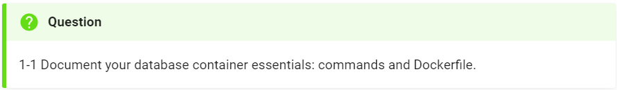
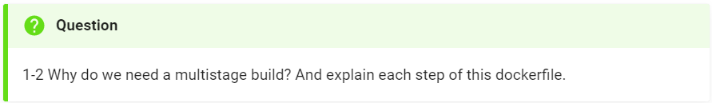
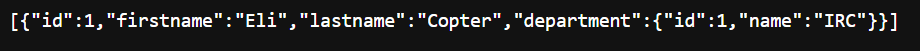
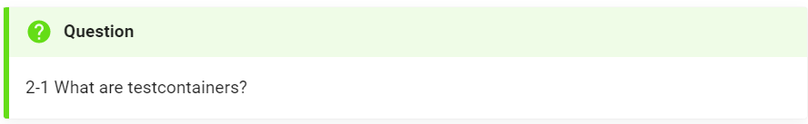
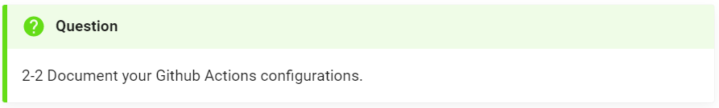
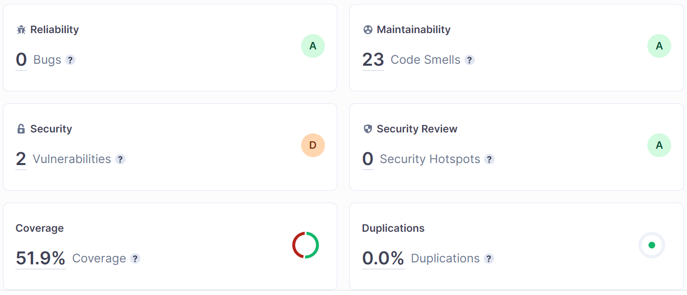
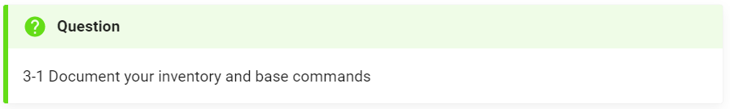
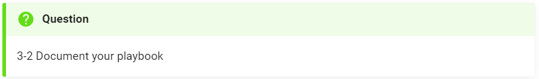
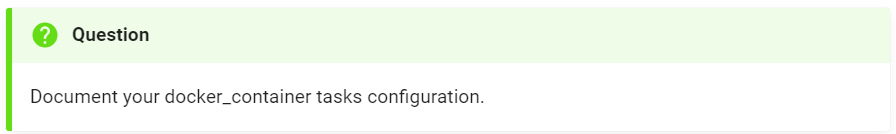
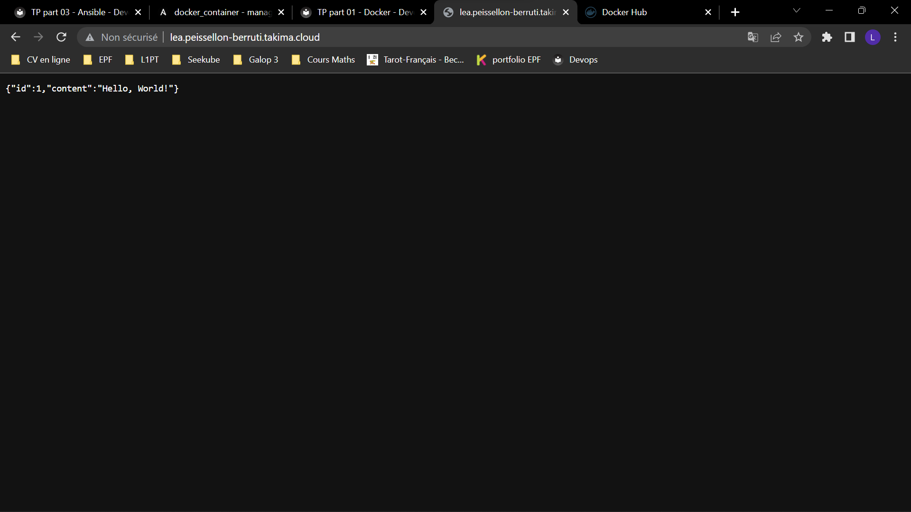

# Compte rendu TP Devops - Léa PEISSELLON BERRUTI

## Lien du répo git

[https://github.com/lpeissel/correction-tp1-devops](https://github.com/lpeissel/correction-tp1-devops)

## Rappels : lignes de commandes de base docker

**Voir la liste des container/image**
 `docker ps`

**Stop running container/image**
 `docker stop container`

**Remove container/image**
 `docker rm container`

**Build une image**
 `docker build -t lpeissel/myfirstapp`

**Run une image/container**
 `docker run -d -p 8888:5000 --name myfirstapp --network=app-network lpeissel/myfirstapp`

**Create network**
 `docker create network networktp1`

## TP1 - Docker

### 1. Database



**Commands** 
`docker build -t lpeissel/database ./database`

`docker run -d --name database -v database-data:/var/lib/postgresql/data --network=networktp1 lpeissel/database`

`docker run -p "8090:8080" --network=networktp1 --name=adminer -d adminer`

**Dockerfile database**

```docker
FROM postgres:14.1-alpine

ENV POSTGRES_DB=db \
POSTGRES_USER=usr \
POSTGRES_PASSWORD=pwd

COPY ./sql/CreateScheme.sql /docker-entrypoint-initdb.d
COPY ./sql/InsertData.sql /docker-entrypoint-initdb.d
```

### 2. Backend API



Cela permet de diviser les images en 2 : une partie build et une partie run qui va run à partir du build. Cela permet d'avoir un container plus léger si on a déja compiler un fichier .jar

**Commands** 

`docker build -t lpeissel/helloworldjava .`

`docker run -d --name helloworldjava lpeissel/hellowordjava`

**Dockerfile helloworldjava**

```docker
# Build
#on récupère l'image du jdk
FROM maven:3.6.3-jdk-11 AS myapp-build  
ENV MYAPP_HOME /opt/myapp
WORKDIR $MYAPP_HOME
 #copy fichier pom.xml dans le dossier .
COPY pom.xml . 
#copy fichier src dans le dossier ./src
COPY src ./src 
#installer le package maven
RUN mvn package -DskipTests 

# Run
FROM openjdk:11-jre  #on récupère l'image du jre qui ne contient pas de compiler
ENV MYAPP_HOME /opt/myapp
WORKDIR $MYAPP_HOME
# on récupère ce qu'on a build et on le copy
COPY --from=myapp-build $MYAPP_HOME/target/*.jar $MYAPP_HOME/myapp.jar 
ENTRYPOINT java -jar myapp.jar #on spécifie qu'on lira des fichier jar en entrée
```

**Let’s now build and run the backend API connected to the database : commands**

On relance la database sur le même network avec le même volume etc
`docker start database`
On build notre image simple api
`docker build -t lpeissel/simple-api .`
On lance la simple api sur le network de la database pourqu'ils puissent communiquer entre eux et on rajoute un port pour y accéder. Notre machine on choisit ici 8080 et par défault le port d'une api est 8080

`docker run -d --name simple-api -p 8080:8080 lpeissel/simple-api`

**Dockerfile database**

```docker
FROM postgres:9.6-alpine

COPY ./scripts/ /docker-entrypoint-initdb.d
```

**Dockerfile simple-api**

```docker
# Build
FROM maven:3.6.3-jdk-11 AS myapp-build
ENV MYAPP_HOME /opt/myapp
WORKDIR $MYAPP_HOME
COPY pom.xml .
RUN mvn dependency:go-offline

COPY src ./src
RUN mvn package -DskipTests

# Run
FROM openjdk:11-jre
ENV MYAPP_HOME /opt/myapp
WORKDIR $MYAPP_HOME
COPY --from=myapp-build $MYAPP_HOME/target/*.jar $MYAPP_HOME/myapp.jar

EXPOSE 8080

ENTRYPOINT java -jar myapp.jar
```

**Résultats API sur localhost:8080/department/IRC/students**



### 3. HTTP server

**Commands** 

`docker build -t lpeissel/httpd .`
`docker run -d --network=networktp1 --name httpd -p 80:80 lpeissel/httpd` 

**Dockerfile httpd**

```docker
FROM httpd:2.4

COPY ./httpd.conf /usr/local/apache2/conf/httpd.conf

EXPOSE 80

CMD ["httpd", "-D", "FOREGROUND"]
```

### 4. Link application

**Commands** 

`docker compose -d up`

`docker compose -d down`

**Docker-compose**

```yaml
version: '3.3'
services:
  backend:
    container_name: backend
    build: ./simple-api
    networks:
      - app-network
    depends_on:
      - database
    restart: on-failure
    volumes:
      - database-data:/var/lib/postgresql/data

  database:
    container_name: database
    restart: always
    build: ./database
    networks:
      - app-network
    env_file:
      - database/.env

  httpd:
    container_name: reverse_proxy
    build: ./httpd
    ports:
      - "80:80"
    networks:
      - app-network

volumes:
  database-data:

networks:
  app-network:
```

## TP2 - Github Actions

### Set up GitHub Actions



They simply are java libraries that allow you to run a bunch of docker containers while testing.



**.github/workflows/main.yml**

```yaml
name: CI devops 2022 EPF
on:
  #to begin you want to launch this job in main and develop
  push:
    branches: master
  pull_request:

jobs:
  test-backend:
    runs-on: ubuntu-18.04
    steps:
      #checkout your github code using actions/checkout@v2.3.3
      - uses: actions/checkout@v2.3.3

      #do the same with another action (actions/setup-java@v2) that enable to setup jdk 11
      - name: Set up JDK 11
        uses: actions/setup-java@v1
        with:
          java-version: 11
          java-package: jdk

      #finally build your app with the latest command
      - name: Build and test with Maven
        env:
          SONAR_TOKEN: ${{ secrets.SONAR_TOKEN }}
        run: mvn -B verify sonar:sonar -Dsonar.projectKey=tp2-sonar -Dsonar.organization=devops-tp2-sonar -Dsonar.host.url=https://sonarcloud.io -Dsonar.login=${{ secrets.SONAR_TOKEN }}  --file ./simple-api/pom.xml

  # define job to build and publish docker image
  build-and-push-docker-image:
    needs: test-backend
    # run only when code is compiling and tests are passing
    runs-on: ubuntu-latest

    # steps to perform in job
    steps:
      - name: Checkout code
        uses: actions/checkout@v2.3.3

      - name: Login to DockerHub
        run: docker login -u ${{ secrets.DOCKER_HUB_USERNAME }} -p ${{ secrets.DOCKER_HUB_TOKEN }}

      - name: Build image and push backend
        uses: docker/build-push-action@v2
        with:
          # relative path to the place where source code with Dockerfile is located
          context: ./simple-api
          # Note: tags has to be all lower-case
          tags:  ${{secrets.DOCKER_HUB_USERNAME}}/correction-tp1-devops:simple-api
          # build on feature branches, push only on main branch
          push: ${{ github.ref == 'refs/heads/master' }}

      - name: Build image and push database
        uses: docker/build-push-action@v2
        with:
          # relative path to the place where source code with Dockerfile is located
          context: ./database
          tags:  ${{secrets.DOCKER_HUB_USERNAME}}/correction-tp1-devops:database
          # build on feature branches, push only on main branch
          push: ${{ github.ref == 'refs/heads/master' }}

      - name: Build image and push httpd
        uses: docker/build-push-action@v2
        with:
          # relative path to the place where source code with Dockerfile is located
          context: ./httpd
          tags:  ${{secrets.DOCKER_HUB_USERNAME}}/correction-tp1-devops:httpd
          push: ${{ github.ref == 'refs/heads/master' }}

      - name: Cache SonarCloud packages
        uses: actions/cache@v1
        with:
          path: ~/.sonar/cache
          key: ${{ runner.os }}-sonar
          restore-keys: ${{ runner.os }}-sonar

      - name: Cache Maven packages
        uses: actions/cache@v1
        with:
          path: ~/.m2
          key: ${{ runner.os }}-m2-${{ hashFiles('**/pom.xml') }}
          restore-keys: ${{ runner.os }}-m2
```

### Setup Quality Gate

Car notre code est pas fou fou, plein de commentaires etc...



## TP3 - Ansible

### 1. Introduction : inventories & facts



**Commands**

`python3 -m pip -V`

`python3 -m pip install --user ansible`

`chmod 400 ./id_rsa` 

`ansible all -i inventories/setup.yml -m ping` 

`ansible all -i inventories/setup.yml -m setup -a "filter=ansible_distribution*"` 

`ansible all -i inventories/setup.yml -m yum -a "name=httpd state=absent" --become` 

**setup.yml**

```yaml
all:
  vars:
    ansible_user: centos
    ansible_ssh_private_key_file: ../../../../../../../../../../../bin/id_rsa
  children:
    prod:
      hosts: lea.peissellon-berruti.takima.cloud
```

### 2. Playbooks



**Commands**

`ansible-playbook -i inventories/setup.yml playbook.yml`

**Playbook.yml**

```yaml
- hosts: all
  gather_facts: false
  become: yes
  roles:
      - docker
      - network
      - database
      - app
      - proxy
```

### 3. Deploy your App



**Role docker (main.yml)**

```yaml
# tasks file for roles/docker
- name: Clean packages
  command:
    cmd: dnf clean -y packages

- name: Install device-mapper-persistent-data
  dnf:
    name: device-mapper-persistent-data
    state: latest

- name: Install lvm2
  dnf:
    name: lvm2
    state: latest

- name: add repo docker
  command:
    cmd: sudo dnf config-manager --add-repo=https://download.docker.com/linux/centos/docker-ce.repo

- name: Install Docker
  dnf:
    name: docker-ce
    state: present

- name: install python3
  dnf:
    name: python3

- name: Pip install
  pip:
    name: docker

- name: Make sure Docker is running
  service: name=docker state=started
  tags: docker
```

**Role network (main.yml)**

```yaml
# tasks file for roles/network
- name: Create a network
  docker_network:
    name: app-network
```

**Role database (main.yml)**

```yaml
# tasks file for roles/database
- name: Run database
  docker_container:
    name: database
    image: lpeissel/correction-tp1-devops:database
    state: started
    env:
      POSTGRES_PASSWORD: pwd
      POSTGRES_USER: usr
      POSTGRES_DB : db
    networks:
      - name: app-network
    volumes:
      - database-data:/var/lib/postgresql/data
```

**Role app (main.yml)**

```yaml
# tasks file for roles/app
- name: Run simple-api
  docker_container:
    name: backend
    state: started
    networks :
      - name: app-network
    image: lpeissel/correction-tp1-devops:simple-api
```

**Role proxy (main.yml)**

```yaml
# tasks file for roles/proxy
- name: Run httpd
  docker_container:
    name: httpd
    image: lpeissel/correction-tp1-devops:httpd
    networks:
      - name: app-network
    ports:
      - "80:80"
```

**API déployée sur serveur**


